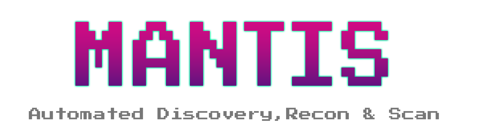
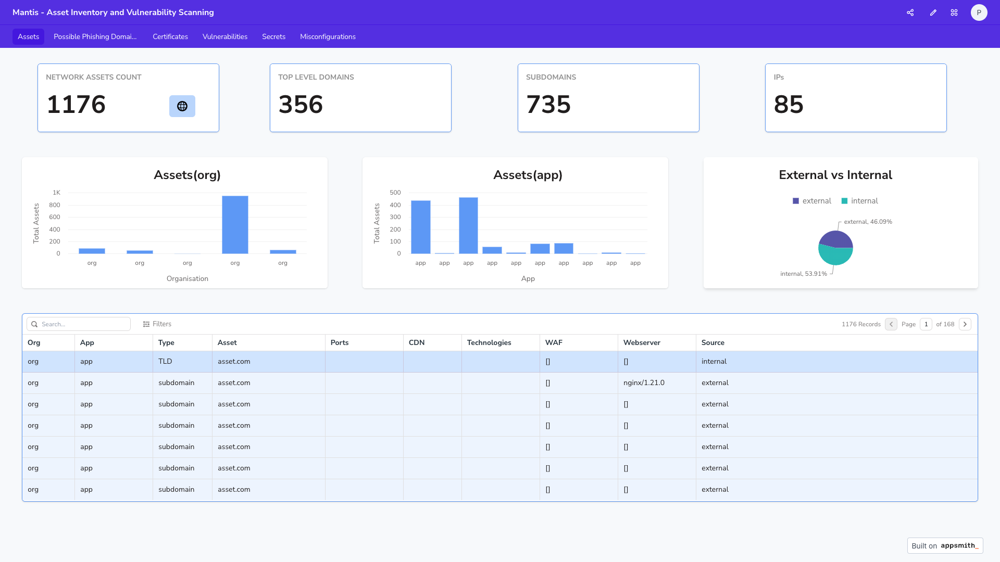

<p align="center">
  <a href="#features-rocket">Features</a> •
  <a href="#modules-">Modules</a> •
  <a href="#installation-%EF%B8%8F">Installation</a> •
  <a href="#command-line-options-%EF%B8%8F">Command Line Options</a> •
  <a href="https://phonepe.github.io/mantis/">Documentation</a> •
  <a href="#contributors">Contributors</a> •
  <a href="https://discord.gg/uJV8Y3uSGu">Join Discord</a>
</p>

> We are in the beta phase of the tool and would like to know if you are facing any installation issues with our framework. If so, please post your issues on our [discord](https://discord.gg/uJV8Y3uSGu).

## Summary

Mantis is a command-line framework designed to automate the workflow of asset discovery, reconnaissance, and scanning. It takes the top-level domains as input, then seamlessly progresses to discovering corresponding assets, including subdomains and certificates. The tool performs reconnaissance on active assets and concludes with a comprehensive scan for vulnerabilities, secrets, misconfigurations and phishing domains - all powered by a blend of open-source and custom tools.


## Features :rocket:

- Automated Discovery, Recon & Scan
- Distributed Scanning (split a single scan across multiple machines)
- Super-Easy Scan Customisation
- Dashboard Support
- Vulnerability Management
- Advanced Alerting
- DNS Service Integration
- Integrate new tool (existing and custom) in minutes

[Click here](https://phonepe.github.io/mantis/features/features.html) to know more about the features in detail. 


## Modules 🧰

- Discovery
    - Subdomains
    - Certificates
- Recon
    - Open Ports
    - Technologies
    - CDN
    - WAF
    - Web Server
    - IP
    - ASN Information
    - Location
- Scan
    - Domain Level Vulnerabilities and Misconfigurations
    - Secrets Scanning
    - Phishing Domains

## Installation ⚙️

Mantis supports multiple installation types. Installing Mantis via Docker would be a good start to get a hang of the framework.

Considering that Mantis also includes MongoDB and AppSmith, we have provided a shell script that installs all the components.

### Minimum System Requirements (Single Machine Scan) 🖥️
- Supported OS: Ubuntu, macOS
- RAM - 4GB
- Cores - 2
- Storage - 16GB

> Warning 🚨 - The framework combines a number of open source and custom tools and runs them in parallel, hence the framework is CPU intensive and is recommended to run the framework on a dedicated VM.  
> The ``-tc`` option controls the parallel processing. If you run it from a machine with low configuration, set the -tc to 1 or 2. If you have a machine with a higher configuration, you can increase the -tc count. 

### Docker 

Setup Video - [Click Here](https://www.youtube.com/watch?v=3PCRIJEOTWo)

Clone the Mantis repository 

```
git clone https://github.com/PhonePe/mantis.git
```

cd into the Mantis directory    

```
cd mantis/setup/docker
```

Run the respective docker setup file based on your OS

```
./docker-setup-macos.sh

./docker-setup-ubuntu.sh
```

## Dashboard Setup 📊

Once the docker setup is complete, please run a scan and follow the below instructions to setup the dashboard.

> Warning 🚨 - Run atleast one scan before setting up dashboard using the command

```shell
mantis onboard -o org_name -t example.in   
```

- The dashboard is accessible at http://mantis.dashboard:1337
- Once you access the dashboard, create an account on AppSmith.
- Now go to base [url](http://mantis.dashboard:1337) 
- Click on 3 dots on right side of the home page and import the template from dashboard_templates folder
- You will be asked to enter db information, enter the following information:
    - host - mantis.db
    - port - 27017
    - default db - mantis

### Assets 



### Vulnerabilities


## Command Line Options 🖥️

```

  usage: 
        ONBOARD: (First time scan, Run this !!)

        mantis onboard -o example_org -t www.example.org
        mantis onboard -o example_org -f file.txt

        SCAN:

        mantis scan -o example_org
        mantis scan -o example_org -a example_app
            

options:
  -h, --help      list command line options

subparser:
  {onboard,scan}
    onboard       Onboard a target
    scan          Scan an org
```

```
usage: 
        ONBOARD: (First time scan, Run this !!)

        mantis onboard -o example_org -t example.tld
        mantis onboard -o example_org -f file.txt

            

options:
  -h, --help            show this help message and exit
  -t HOST, --host HOST  top level domain to scan
  -f FILE_NAME, --file_input FILE_NAME
                        path to file containing any combination of TLD, subdomain, IP-range, IP-CIDR
  -w WORKFLOW, --workflow WORKFLOW
                        workflow to be executed as specified in config file
  -o ORG, --org ORG     name of the organisation
  -a APP, --app APP     scan only subdomains that belong to an app
  -p, --passive         run passive port scan
  -s, --stale           mark domains as stale (domains purchased but not in use)
  -i, --ignore_stale    ignore stale domains during scan
  -tc THREAD_COUNT, --thread_count THREAD_COUNT
                        thread count, default 10
  -r, --use_ray         use ray framework for distributed scans
  -n NUM_ACTORS, --num_actors NUM_ACTORS
                        number of ray actors, default 10
  -d, --delete_logs     delete logs of previous scans
  -v, --verbose         print debug logs
  -aws AWS_PROFILES, --aws_profiles AWS_PROFILES
                        List of comma separated aws profiles for Route53

```

## Run a scan 🔍

You want to onboard an org with its TLDs/IPs/IP-CIDRs/IP Range for the first time, use the onboard mode. This runs the scan on the default workflow.

#### TLD

```shell
mantis onboard -o org_name -t example.in   
```
#### IP

```shell
mantis onboard -o org_name -t 10.123.123.12
```

#### IP-Range

```shell
mantis onboard -o org_name -t 203.0.113.0-10
```

#### IP-CIDR

```shell
mantis onboard -o org_name -t 203.0.113.0/24
```

### Onboard Known Assets and Scan
```shell
mantis onboard -o org_name -f input.txt
```

### Scan on all assets belonging to an organisation

Now that you have onboarded, you just need to run scheduled scans for an org, you can just use the scan mode

```shell
mantis scan -o org_name
```

### Scan on all assets belonging to an organisation and app

```shell
 mantis scan -o org_name -a app_name
```


## How to contribute ?

If you want to contribute to this project:

* Submit an issue if you found a bug, or a have a feature request.
* Make a Pull Request from dev branch if you want to improve the code.

## Need Help ? 🙋‍♂️
    
* Take a look at our [documentation](https://phonepe.github.io/mantis/)
* Please join our [discord channel](https://discord.gg/uJV8Y3uSGu)

## Credits 🎖

**Development** - Prateek Thakare  
**Recon Tools Design/Launch scripts** - Bharath Kumar  
**Secret Scanning** - Hitesh Kumar, Saddam Hussain  
**Dashboard** - Pragya Gupta  
**Design Suggestions** - Dhruv Shekawat, Santanu Sinha  
**Framework Design** - Praveen Kanniah  

**Special Thanks** - Ankur Bhargava

## Contributors

<p align="left">
<a href="https://github.com/phonepe/mantis/graphs/contributors">
  
</a>
</p>

## Disclaimer

Usage of this program for attacking targets without consent is illegal. It is the user's responsibility to obey all applicable laws. The developer assumes no liability and is not responsible for any misuse or damage caused by this program. Please use responsibly.

The material contained in this repository is licensed under Apache2.

