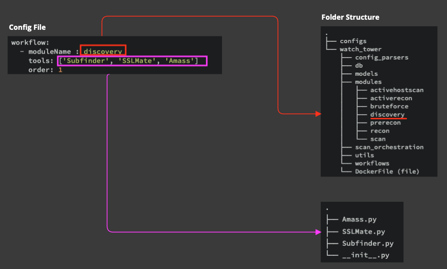

# Code - Folder Structure
---

This is an overview of the Mantis code's folder structure.

```console
.
├── configs
└── mantis
    ├── config_parsers
    ├── db
    ├── models
    ├── modules
    │   ├── Route53
    │   ├── activehostscan
    │   ├── activerecon
    │   ├── discovery
    │   ├── prerecon
    │   ├── scan
    │   └── secretscanner
    │       └── submodules
    ├── scan_orchestration
    ├── tool_base_classes
    ├── utils
    └── workflows
    └── DockerFile (file)
```
> INFO💡: Before we begin, remember, the entire automation process is referred to as a workflow in Mantis, which is further broken down into modules, and modules are further broken down into tools.

For the purpose of new integrations, let's look at the folders that will be most relevant to our objective.

- **configs** - This folder contains the file **local.yml**, which is where, you do most of your framework customisations
- **db** - Not every file under db will interest you, except the **db_models.py**. This file contains the db schema
- **modules** - This folder contains the scanner classes categorized by each module. Here's a quick look inside one of the modules folder **discovery**
    ```console
    .
    ├── Amass.py
    ├── SSLMate.py
    ├── Subfinder.py
    └── __init__.py
    ```
- **utils** - Again not every file is of importance, except the **tool_utils.py**. This file contains functions that will make your life simple during new integrations
- **DockerFile** - Last, the **DockerFile** itself, where you will add the installation instructions for new scanners, if any

## A Quick Correlation to local.yml

This is a snippet of the workflow section in local.yml

```yml
workflow: 
  - moduleName : discovery
    tools: ['Subfinder', 'SSLMate', 'Amass'] 
    order: 1
  - moduleName: prerecon
    tools: ['FindCDN', 'Naabu', 'IPinfo'] 
    order: 2
  - moduleName: activehostscan
    tools: ['HTTPX_Tech', 'HTTPX']
    order: 3
  - moduleName: activerecon
    tools: ['Wafw00f']
    order: 4
  - moduleName: scan
    tools: [ 'DNSTwister', 'Csper', 'SecretScanner']
    order: 4

```

Let's do a quick correlation.



- **moduleName**, i.e. discovery, prerecon, activehostscan etc. are sub-folders under modules folder
- **tools** under each moduleName, e.g. under discovery, you can find Subfinder, SSLMate, Amass, are the name of the scanner classes defined under each module

> ⏭️ Now that you have a basic understanding of the folder structure, lets now understand the different types of scanner base class that Mantis offers.


