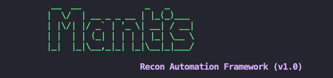

# 🖥️ Command Line
---

Mantis ships with a simple list of command line options.



```shell

  --mode {onboard,scan}                   Select mode of operation
  -h, --help                              list command line options
  -t HOST, --host HOST                    top level domain to scan
  -f FILE_NAME, --file_input FILE_NAME    path to file containing any combination of TLD, subdomain, IP-range, IP-CIDR
  -w WORKFLOW, --workflow WORKFLOW        workflow to be executed as specified in config file
  -o ORG, --org ORG                       name of the organisation
  -a APP, --app APP                       scan only subdomains that belong to an app
  -p, --passive                           run passive port scan
  -s, --stale                             mark domains as stale (domains purchased but not in use)
  -i, --ignore_stale                      ignore stale domains during scan
  -r, --use_ray                           use ray framework for distributed scans
  -n NUM_ACTORS, --num_actors NUM_ACTORS  number of ray actors, default 10
  -d, --delete_logs                       delete logs of previous scans

```