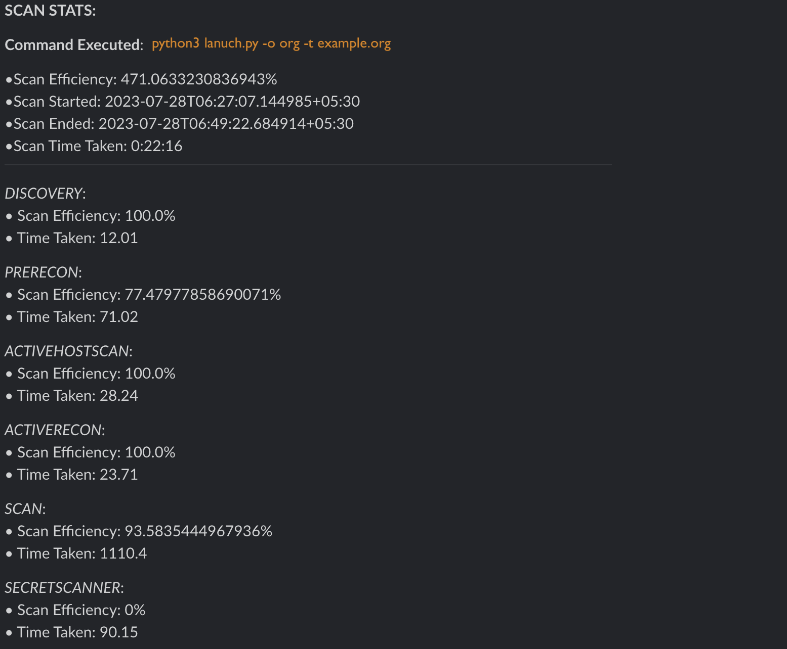
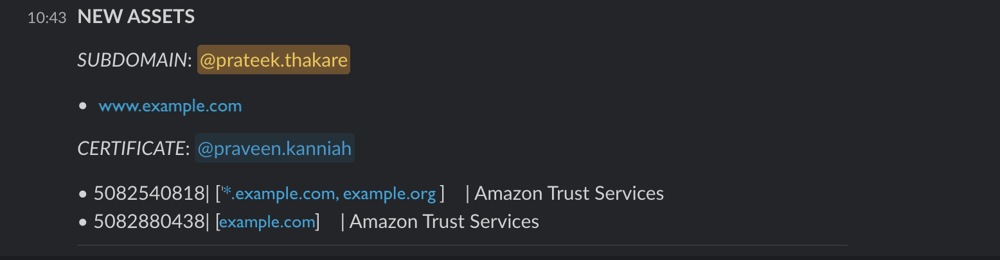

# Advanced Alerting
---

<product-team>product security teams</product-team> <bug-bounty>bug bounty hunters </bug-bounty>

## 🤔 Use-Case
**I want to:**
- *customise my alerts, say, today i recieve alerts only for vulnerabilities, tomorrow i need to start receiving alerts for my phishing domains as well, there shouldnt be any code change*
- *tag specific teams for specific alerts*

## 😃 Feature

Alerting is **layered and config driven** with no code change required in Mantis. There are two **types of alerting** that Mantis supports:

- Assets and Findings
- Scan Stats

Currently, we support notifications via **slack**

## Slack Alerts Example

### Scan Efficiency Alert

### New Assets Alert

### Understanding config.yml
> INFO💡: For more details on config.yml and how to edit it, [Click here](/./mantis/configuration/configuration.md)
