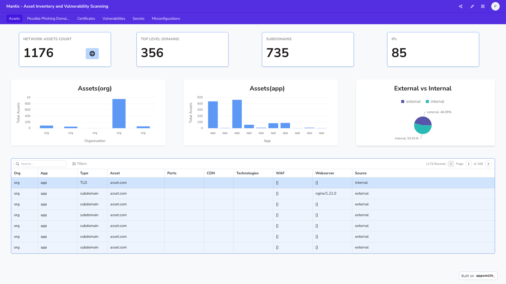
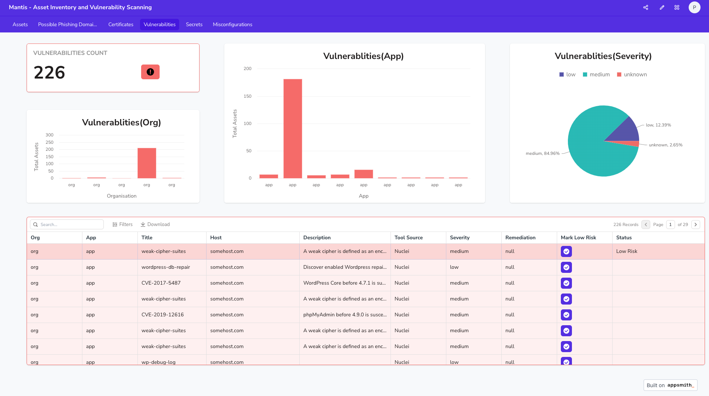
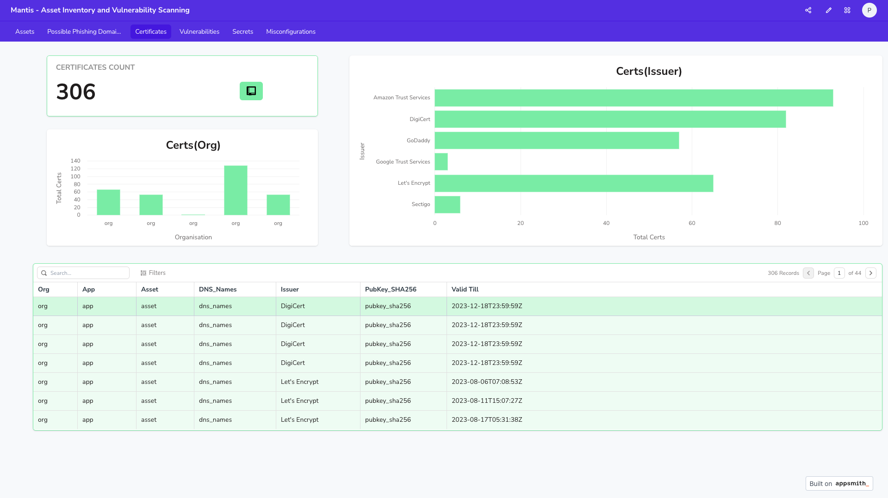

# Dashboard Support
---

<product-team>product security teams</product-team> <bug-bounty>bug bounty hunters </bug-bounty>

## 🤔 Use-Case
**I want to:**
- *create a dashboard that provides an overview of my organization, its assets, and its findings*

## 😃 Feature

Mantis does not come with a dashboard as creating a user interface can be highly opinionated. 

Instead, Mantis provides details of assets and findings in a structured format in MongoDB. Any dashboard that supports MongoDB integration should work with Mantis's output

Mantis's integration works well with the following dashboard:

- [AppSmith - Default Support](https://www.appsmith.com/)
- [Chartbrew](https://chartbrew.com/)
- [Metabse](https://www.metabase.com/start/oss)

## 😮 How does Mantis look with AppSmith  ?

### Assets

### Vulnerabilities

### Certificates

