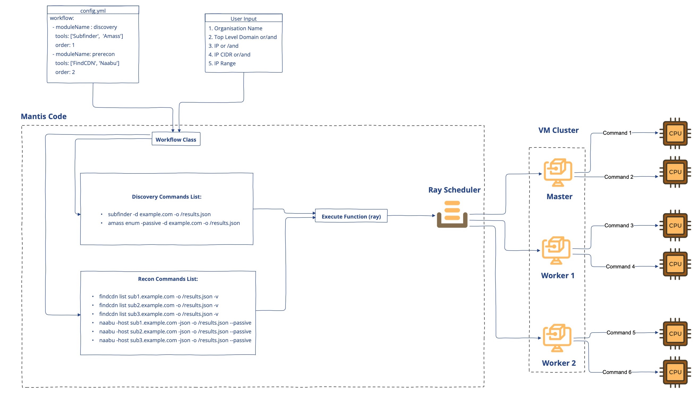

# Distributed Scanning
---

<product-team>product security teams</product-team>

## 🤔 Use-Case
**I want to:**
- *scale my single scan across multiple machines. The number of assets owned by my organization is too large to scan on a single machine within a reasonable timeframe, making it either impossible or excessively time-consuming*

## 😃 Feature
Mantis is one of the first recon automation framework that that allows you to **distribute your single scan across multiple machines**, including bare metals or instances in AWS or Azure.. 

## How does Mantis distribute your scan ? 

Mantis uses [Ray](https://www.ray.io) framework to scale. [Ray Core](https://docs.ray.io/en/latest/ray-core/walkthrough.html) provides a small number of core primitives (i.e., tasks, actors, objects) for building and scaling distributed applications.   

> Please Note - A short infrastructure setup is required before utilising this feature as [described here](/./installation/installation-multiple.md)

The Mantis framework is designed to use Ray Core in the most efficient way, breaking down a single scan into the most granular level. To put it simply:

- Each module has a specific assigned order number that indicates the sequence in which it should be executed. For example, Discovery needs to run before Recon, with Discovery's order number being 1 and Recon's being 2
- Scans required for each module are run in parallel while other modules wait for the previous module's completion
- The **Workflow Class** retrieves the module name and order from the **config.yml** file and generates commands for all the tools in each module for every asset. This list of commands is then passed to the Ray function
- The Ray function distributes these commands across VMs and allocates **a single CPU for every command**
- Ray's self-managed scheduling system ensures efficient allocation of resources, and **configurable retries against potential failures** provide added reliability

> INFO💡: All of the internal implementation described above is for your information only. Once you have your infrastructure set up, all you need to do is add the IP addresses of your VMs to the configuration file, and everything else remains the same

