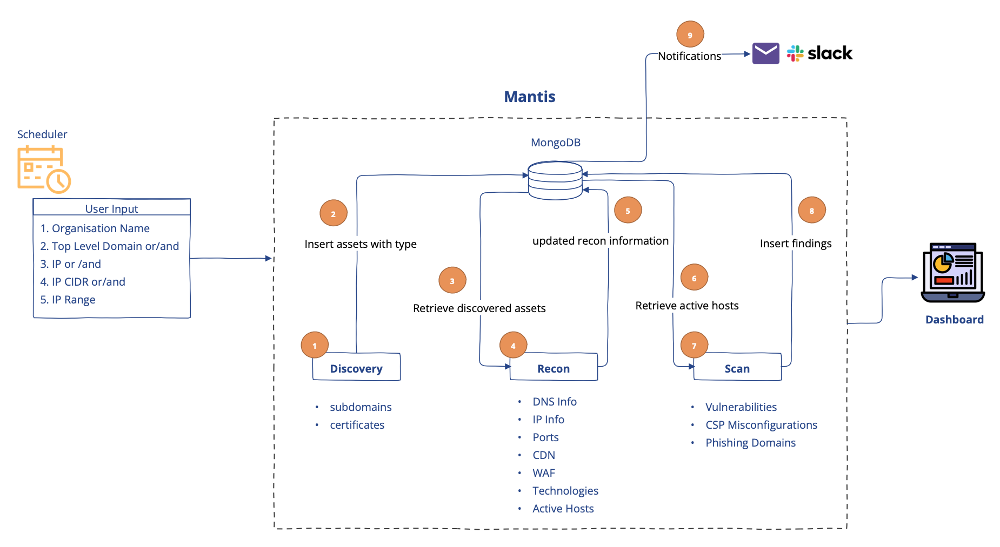

# Recon Automation
----
<product-team>product security teams</product-team> <bug-bounty>bug bounty hunters </bug-bounty>

## 🤔 Use-Case
**I want to:**
- *automate the entire process of asset discovery, reconnaissance, and vulnerability scanning*
- *store relevant details with contextual information in a database and retrieve them at any time*
- *schedule scans and set up alerts*

## 😃 Feature
Mantis **automates the entire process from discovery to scan** and stores organization and application-based context in a MongoDB database. 

The framework also provides easily **customizable alerting capabilities** with no code changes required.

## Automation Overview

Mantis is capable of understanding top-level domain, IP, IP-CIDR, IP Range or even subdomains as user input

- **Discovery module** efficiently enumerates top-level domains provided as user input to identify subdomains
- **Reconnaissance module** fetches crucial and relevant information about assets required for vulnerability scanning
- **Scan module** is designed to identify misconfigurations and vulnerabilities 