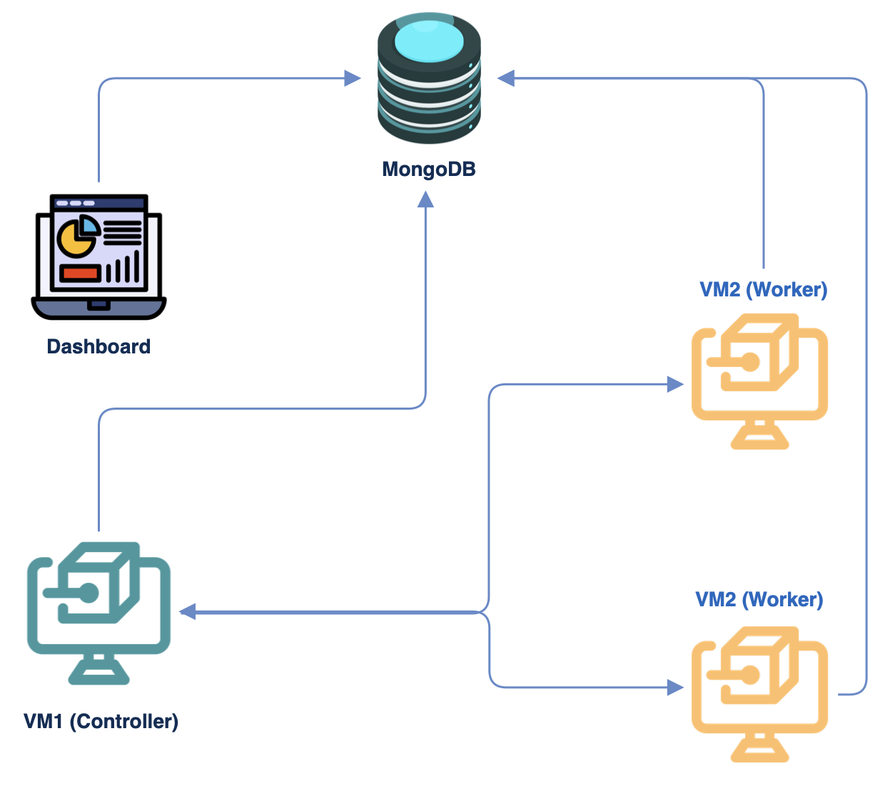

# 🛠️ Mulitple VM Setup 
---

## Setup Overview

Mantis consists of three main components:
- Mantis Scan Framework
- MongoDB
- Dashboard (currently Appsmith; a proprietary dashboard is coming soon)

The single machine [**docker setup scripts**](https://github.com/PhonePe/mantis/tree/main/setup/docker) will install all three components by default. Although this setup might suffice for testing Mantis or addressing basic needs, it can become slow as you onboard more organizations or when you need to scan your assets regularly. This is when distributed scanning becomes advantageous.

*In a distributed scanning setup, the components should be set up separately to enhance performance.*

- The distributed scanning operates on the principle of the controller/worker model
- There is a main controller that distributes the tasks to the workers
- Both the controller and the workers communicate with a common database
- The dashboard is set up separately and connects with the database to pull information

## Controller/Worker Hardware Requirements

For a single VM, this is a baseline requirement where we run scans on almost 1700 assets every day

- **OS**: Ubuntu
- **Core**: 4 
- **Memory**: 16 GB (cores can vary if you dont want to scan your assets frequently)

> ⏭️ Let's now install the required components 